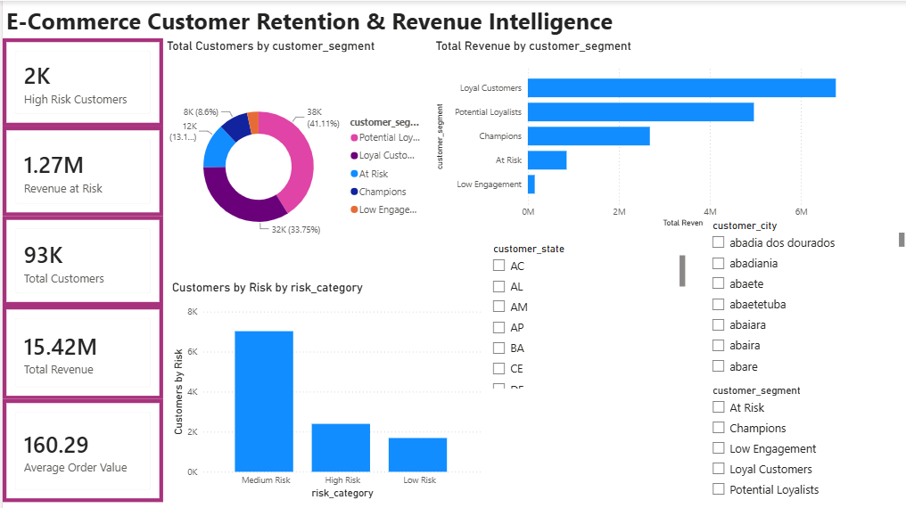
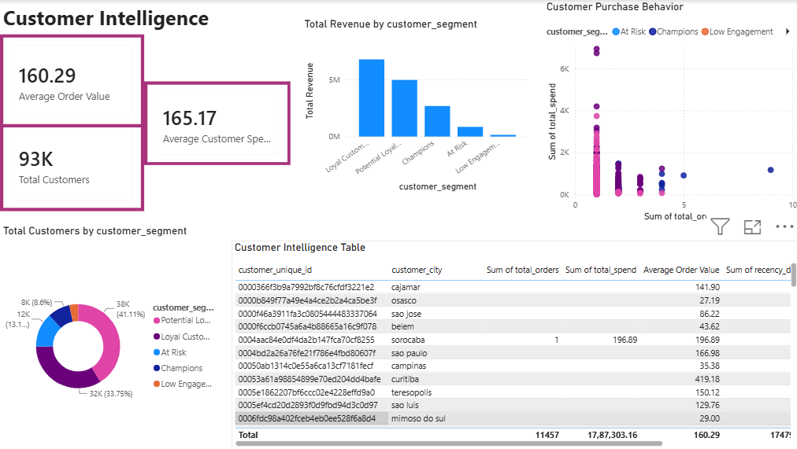
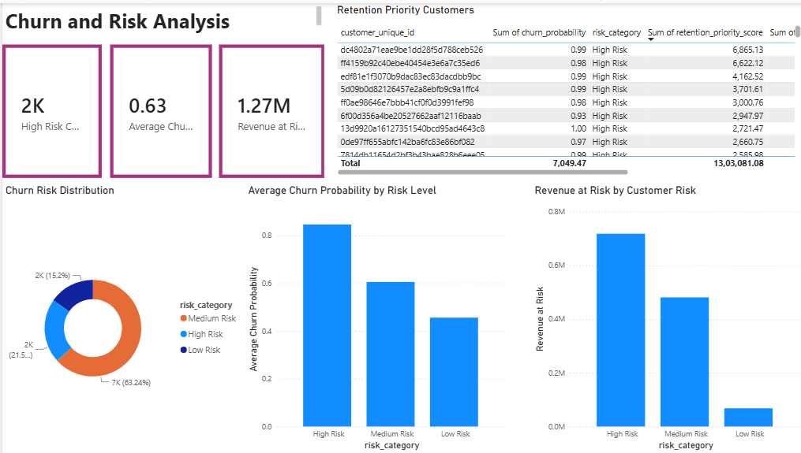
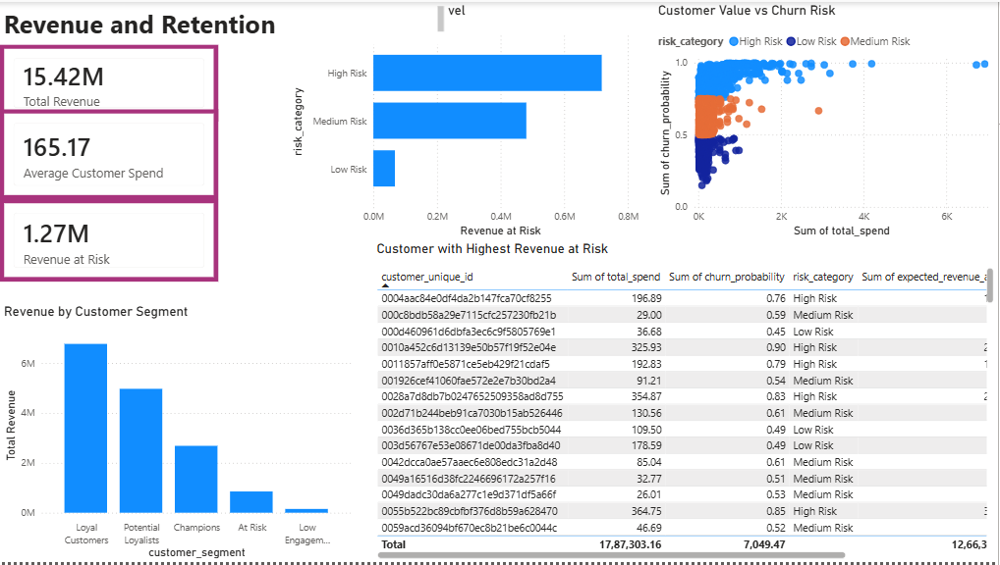

# E-Commerce Customer Retention & Revenue Intelligence

An end-to-end Data Science and Business Intelligence project that combines customer analytics, machine learning, explainable AI, and Power BI to identify churn risk and quantify potential revenue exposure.

---

## 📌 Project Overview

Customer retention is a major challenge for e-commerce businesses. Instead of only analyzing historical sales, this project builds a data-driven system to answer:

- Which customers are likely to stop purchasing?
- What customer behaviors are associated with churn?
- Which customer segments are most valuable?
- How much revenue is potentially at risk?
- Which customers should be prioritized for retention?

The project transforms raw e-commerce transaction data into customer-level insights, churn predictions, explainable risk factors, and an interactive business intelligence dashboard.

---

## 🎯 Objectives

1. Analyze customer purchasing behavior.
2. Create customer-level behavioral features.
3. Segment customers using RFM analysis.
4. Predict future customer churn using machine learning.
5. Compare Logistic Regression and Random Forest models.
6. Explain predictions using SHAP.
7. Estimate potential revenue at risk.
8. Create a retention priority score.
9. Present business insights through Power BI.

---

## 🏗️ Project Architecture

```text
Raw E-Commerce Data
        ↓
Data Cleaning & Validation
        ↓
Customer-Level Feature Engineering
        ↓
RFM Customer Segmentation
        ↓
Time-Based Churn Definition
        ↓
Machine Learning Models
   ┌───────────────┐
   │ Logistic Reg. │
   │ Random Forest │
   └───────────────┘
        ↓
Churn Probability
        ↓
SHAP Explainability
        ↓
Risk Categorization
        ↓
Revenue at Risk
        ↓
Retention Priority
        ↓
Power BI Dashboard


## 📈 Power BI Dashboard
### Dashboard Preview

#### Executive Overview


#### Customer Intelligence


#### Churn & Risk Analysis


#### Revenue & Retention

